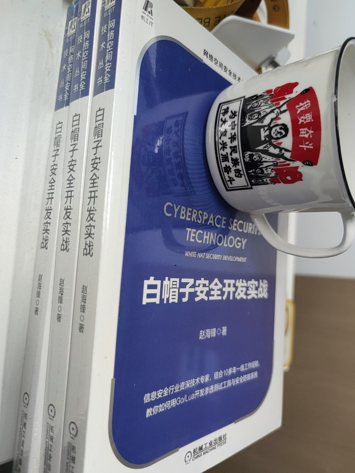

## 白帽子安全开发实战配套代码仓库

本仓库为《白帽子安全开发实战》实体书的配套代码，书已在各大电商网站开卖。

### 购买链接：

- [京东](https://item.jd.com/12774589.html)（据说元旦有满100-50的活动，可以等元旦再下手）
- [当当](http://product.dangdang.com/29174575.html)（还在备货中）

### 代码索引

* [第2章 扫描器](./scanner)
    * [单线程的TCP Connect扫描器](./scanner/cp-connect-scanner-demo)
    * [支持并发的tcp connect扫描器1](./scanner/tcp-connect-scanner1/)
    * [支持并发的tcp connect扫描器2](./scanner/tcp-connect-scanner2/)
    * [单线程的TCP半连接扫描器](./scanner/tcp-syn-scan-demo/)
    * [支持并发的TCP半连接扫描器](./scanner/tcp-syn-scanner/)
    * [同时支持connect、syn的扫描器](./scanner/tcp-scanner-final/)
    * [弱口令扫描器](./scanner/password_crack/)
    * [代理服务器扫描器](./scanner/proxy-scanner/)
* [第3章 常见的后门](./backdoor)
    * [正向后门](./backdoor/bind_shell/)
    * [反向后门](./backdoor/reverse_shell/)
    * [go语言版的webshell](./backdoor/webshell/)
    * [lua版的webshell](./backdoor/nginx_lua_security/)
    * [http协议的C&C服务器](./backdoor/command-control/command-control-demo/)
    * [http2协议的C&C服务器](backdoor/command-control/command-control-final/)
* [第4章 嗅探器](./sniffer)
    * [以16进制格式输出数据包内容的Demo](./sniffer/demo/)
    * [解析数据包的Layers类型](./sniffer/decode_layers/)
    * [具有密码监听功能的嗅探器](./sniffer/sniff_password/)
    * [arp欺骗数据包构造](./sniffer/send_arp/)
    * [arp欺骗数据包构造](./sniffer/send_arp/)
    * [支持arp欺骗的嗅探器demo](./sniffer/arp_sniff_demo/)
    * [go语言版的webspy](./sniffer/webspy/)
* [第5章 恶意流量分析系统](./traffic-analysis)
    * [流量分析系统的传感器](./traffic-analysis/sensor/)
    * [流量分析系统的服务端](./traffic-analysis/server/)
* [第6章 Exchange邮箱安全网关](./exchange-security-gateway)
    * [Exchange邮箱安全网关主程序(lua)](./exchange-security-gateway/exchange-sec-gateway/)
    * [Exchange邮箱安全网关后端接口(go)](./exchange-security-gateway/exchange-sec-gateway-api/)
* [第7章 蜜罐](./honeypot)
    * [蜜罐Agent](./honeypot/agent/)
    * [蜜罐后端server](./honeypot/server/)
    * [蜜罐日志服务器](./honeypot/log_server/)
* [第8章 代理蜜罐](./proxy-honeypot)
    * [代理蜜罐agent](./proxy-honeypot/agent/)
    * [代理蜜罐server](./proxy-honeypot/server/)
    * [代理蜜罐管理端](./proxy-honeypot/manager/)
    * [scripts](./proxy-honeypot/scripts/)
* [第9章 waf](./waf)
    * [waf主程序（lua）](./waf/x-waf/)
    * [waf管理端（go+macron）](./waf/x-waf-admin/)
* [第10章 零信任安全网关](./zero-trust)
    * [cel-go规则引擎测试代码](zero-trust/cel-test/)
    * [中间件Demo](./zero-trust/middleware/)
    * [反向代理Demo](./zero-trust/reverse-proxy-demo/)
    * [零信任网关的反向代理demo](./zero-trust/zero-trust-demo/)
    * [零信任安全代理](./zero-trust/zero-trust-proxy/)

